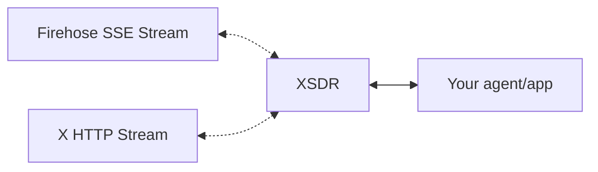

A unified pipeline for monitoring activity on X and the web. Define criteria and we'll send matches to your webhooks, in real-time.

Traditionally, humans and agents interact with the web on a polling-basis. This doesn't work when you need to use or search for something that doesn't exist yet.

With XSDR, you can:
- Trigger workflows based on real-time events
- Receive notifications about events as they happen (news, X posts, sports, etc)

## Example Use-Cases
- Monitor customer sentiment
- Keep tabs on your competitors
- Automate social engagement
- Trigger agentic loops
- Build bots
- Conduct research
- Streamline crypto/stock/prediction market trading

## How It Works

